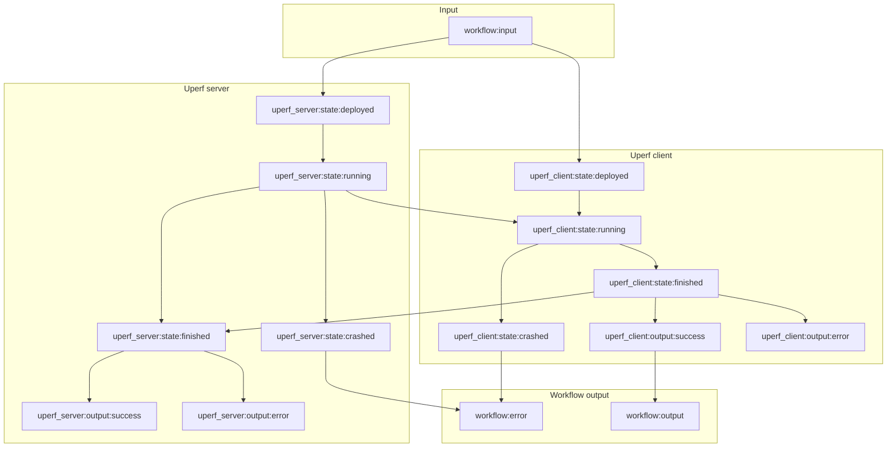

# Adding signals to the Arcaflow execution model

## Background

On Friday the 17th of November 2022 we had a very lengthy discussion with the Red Hat Performance & Scale Middleware
team. They have introduced us to their extremely powerful tool for executing workflows called
[qDup](https://github.com/Hyperfoil/qDup). This tool not only allows people to write workflows, but also dynamically
react to outputs of programs and publish signals on an internal messaging bus. Workflow parts can communicate with each
other even while running, sending and waiting for signals.

Arguably, qDup can do more than Arcaflow at this point. However, it requires a great deal of expertise and forethought
as it doesn't have the safety guarantees that Arcaflow does, such as schemas or possible static analysis of the code.

It is the aim of this proposal that Arcaflow should receive the signaling mechanism, allowing plugins to exchange
messages during execution. This proposal incorporates the plan to create data streaming, as signals will allow plugins
to transmit chunks of data.

## Proposal

Currently, Arcaflow allows the plugin to output only one of many possible outputs. This limits their usefulness,
as the plugin must finish execution to transmit information.

In this proposal, we transform the execution of Arcaflow by adding the ability to send and receive signals via signal
channels. Each signal channel will have a schema and is declared by a plugin. Workflow authors can take these signals 
and pipe them into other plugins that have declared they can receive signals.

In a workflow, this may look as follows:

```yaml
steps:
  foo:
    ...
  bar:
    listen:
      signal_listener_key_declared_by_plugin: !expr $.steps.foo.signals.something
```

In this case the `bar` plugin will have declared a signal listener called `signal_listener_key_declared_by_plugin`
together with a schema, and it must match the signal emitter called `something` in the `foo` plugin. The 
`$.steps.foo.signals.something` expression refers to the signal channel.

### Closing signal channels

Plugins can also close signal channels, which will notify all listening plugins that there are no more signals
coming. If the plugin terminates, the signal channel is closed automatically.

### Deployment and input information

The deployment and input of a plugin constitutes a special signal listener that receives exactly one signal of a kind.
If more than one signal is sent on the signal channel, the consecutive messages are ignored.

However, a workflow author may, with the help of an expression, collect all signals in a channel into a list. This will
delay the evaluation of that expression until the signal channel is closed and all messages of a kind are received.

For example:

```yaml
steps:
  foo:
    ...
  bar:
    input:
      baz: !expr collect($.steps.foo.signals.something)
```

### Outputs

The current normal output results will also be transformed into signals, which depend on the completion of a plugin.
However, a plugin is now allowed to not declare an output and work with signals instead.

The workflow outputs will work as before. They act as a signal channel that will only ever receive one signal and then
be closed.

Workflow outputs can reference outputs in the same way and will receive the single signal that is sent in the event that
the plugin outputs that particular output.

If workflow outputs reference non-output signals, they should use the `collect()` function or similar to make sure they
capture all signals in a particular channel if that is desired.

### Prematurely stopping plugin execution

With the help of a signal, a workflow author can stop the execution of a plugin prematurely. The plugin will receive a
notification of the signal and may decide to end correctly or crash.

The workflow author may declare this as follows (syntax may change):

```yaml
steps:
  uperf_client:
    ...
  uperf_server:
    stop_if:
      - !expr $.steps.uperf_client.state.finished
```

If such a situation happens, the plugin will receive a `SIGTERM`. The plugin is allowed to emit an output or additional signals, but must then terminate in an orderly fashion. Should the plugin not terminate within a timeout (default: 30 seconds), the plugin will be stopped with a `SIGKILL`. Python SDK users will get appropriate hooks to interrupt the execution.

### Step states

First, we introduce the following states for a step:

1. **Deployed:** The plugin has been deployed, but no execution has started yet. This is useful for the deployer to emit information, such as the IP Address.
2. **Running:** The plugin execution has started and the plugin can now send and receive signals.
3. **Crashed:** The plugin execution has ended unexpectedly. This will cause the workflow to fail.
4. **Finished:** The plugin execution has finished normally.

### Effects on the dependency tree

We will, however, introduce the following new nodes for each step:

1. `state:deployed`
2. `state:running`
3. `state:crashed`
4. `state:finished`

In addition, we will also introduce nodes for each of the signals the plugin emits, prefixed with `signal:`. The
outputs will be prefixed with `output:`.

In order to ensure that a workflow can be executed, signals constitute a dependency on the step in the dependency tree.
This means, that two steps cannot depend on each other's signals, nor can three or more steps form a dependency circle.
This constitutes a limitation, because no two steps can form a constant back and forth communication via signals.

### Example

The following simple example does not use signals, but showcases the possible use cases of the new dependency tree
additions:



More examples of real-life workflows are welcome.

## Necessary changes

### ATP changes

For this proposal to work, the ATP must be extended by the following mechanisms:

1. The ability to declare signal channels.
2. The ability to send and receive signals.
3. The ability to signal an early termination.

This is a backwards-incompatible change and the ATP version must be increased.

### SDK changes

In order to accommodate this proposal, the SDKs must receive the following updates:

1. The ability to declare signal channels and get a handle for receiving such signals. In Go, the SDK must pass a Go channel. In Python, this may be a generator.
2. The ability to receive early termination signals.

### Engine changes

The core engine loop needs to be overhauled to work with channels on which signals are received. Additionally,
the engine must handle ATPv1 plugins and avoid sending early termination signals to such plugins. Instead, the engine
should send a SIGTERM to these plugins.

## Voting Period

This proposal is currently up for discussion. No voting period has been set. Expected implementation is some time in Q1 2023.

## Benefits

### Interoperability with qDup and other message buses

This proposal opens up the possibility for interoperability with qDup:

- A qDup plugin can publish signals from Arcaflow to qDup and vice versa.
- We may be able to ingest qDup workflows and transform them into Arcaflow workflows with `any` schemas.
- It will possibly allow us to interact with other messaging buses, such as [state-signals](https://github.com/distributed-system-analysis/state-signals).

### More flexible workflows

- This proposal keeps the current workflow format, but adds the ability to more dynamically react to events and plugins
to cooperate.
- It also implements data streaming as a side effect.
- In addition, it allows us to dynamically stop plugins when needed.

## Drawbacks

- This proposal makes the engine more complex.
- There is a significant limitation in that the plugin sending a signal has no way of receiving feedback if the signal has been properly consumed. However, this prevents deadlocks in the workflow execution.